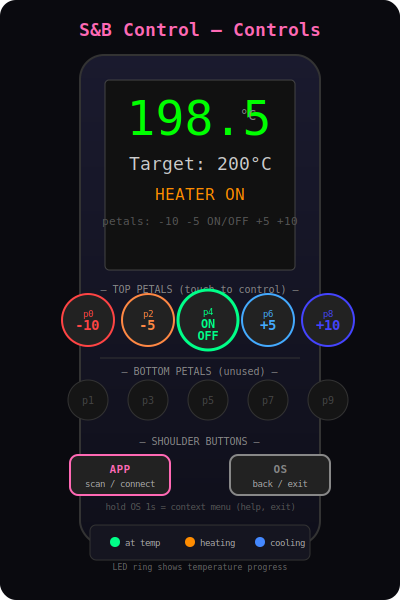
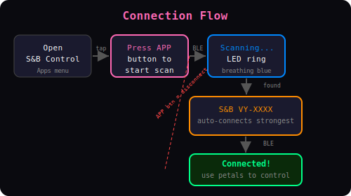
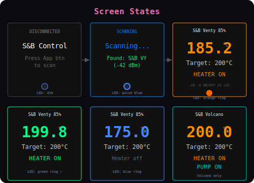

# flow3r-sb

**Control your Storz & Bickel vaporizer from a flow3r badge.**

A MicroPython app for the [flow3r](https://docs.flow3r.garden/) conference badge
that connects to Storz & Bickel vaporizers via BLE and provides a touch-based UI
for temperature control.

## Supported Devices

- Venty
- Veazy
- Volcano Hybrid
- Crafty+

## Installation (Real Badge)

1. Connect your flow3r badge via USB (Disk Mode)
2. Copy this folder to `apps/sb_control` on the badge
3. Restart the badge
4. Find "S&B Control" in the Apps menu

## Quick Development (mpremote)

```bash
# Install mpremote
pip install mpremote

# Connect badge via USB, then:
mpremote run __init__.py
```

## Simulator Setup

The flow3r firmware includes a Python/Pygame simulator. BLE won't work in the
simulator, but you can test the UI and touch input.

```bash
# Clone firmware (includes simulator)
git clone --depth 1 https://git.flow3r.garden/flow3r/flow3r-firmware
cd flow3r-firmware

# Install dependencies
python3 -m venv venv
venv/bin/pip install pygame requests pymad
venv/bin/pip install wasmer wasmer-compiler-cranelift

# Copy our app into the simulator
cp -r /path/to/flow3r-sb python_payload/apps/sb_control

# Run simulator
venv/bin/python sim/run.py

# Or launch app directly:
venv/bin/python sim/run.py "S&B Control"
```

**Note:** The simulator does not support BLE. The app will show
"Press App btn to scan" but cannot actually connect to devices.
Use it to test the UI layout and petal touch input.

## Controls



| Control | Action |
|---------|--------|
| Petal 0 (top left) | Target temp -10°C |
| Petal 2 (top left-center) | Target temp -5°C |
| Petal 4 (top center) | Toggle heater on/off |
| Petal 6 (top right-center) | Target temp +5°C |
| Petal 8 (top right) | Target temp +10°C |
| App button (left shoulder) | Scan / connect / disconnect |
| OS button (right shoulder) | Back / exit |
| Hold OS 1s | Context menu (help, exit) |

## Connection



1. Open "S&B Control" from Apps menu
2. Press APP button to start BLE scan
3. LED ring breathes blue while scanning
4. App auto-connects to strongest S&B device found
5. Use petals to control temperature

## Display States



- **Current temperature** — large number in center
- **Target temperature** — below current
- **Heater status** — ON (orange) / off (gray)
- **Pump status** — ON (Volcano only)
- **Battery** — top right (Venty/Veazy)
- **LED ring** — temp progress (orange when heating, blue when cooling)

## Requirements

- flow3r badge with firmware v1.4.0+
- Storz & Bickel device powered on and in BLE range

## Protocol

Uses the same BLE protocol as [storz-rs](https://github.com/flakesonnix/storz-rs),
reverse-engineered from the official app.
